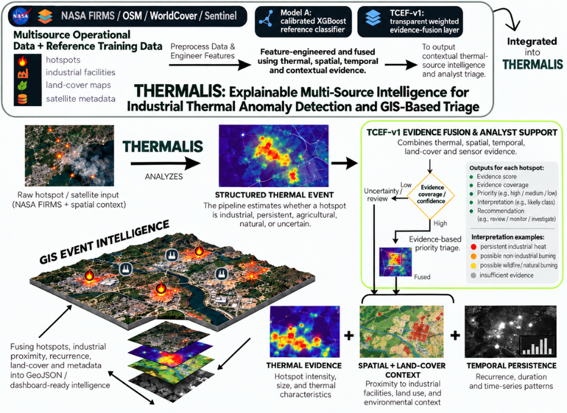
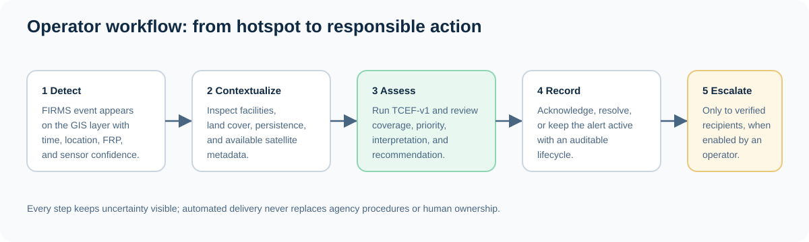

# Thermalis

### Industrial fire and persistent thermal-source intelligence for SIH PS-162

Thermalis turns satellite thermal anomalies into explainable, map-based operational intelligence. It combines NASA FIRMS detections with industrial context from OpenStreetMap, land-cover information, persistence features, satellite metadata, and a controlled alert workflow.

> **Scope note:** Thermalis is a decision-support and triage platform. Its evidence score is not a calibrated probability of fire. Model A is deliberately limited to its documented reference classes, and emergency dispatch is disabled by default.



## Why this exists

NASA FIRMS can report a thermal anomaly, but a hotspot alone does not explain whether it represents industrial process heat, an accidental industrial fire, crop burning, a wildfire, or another source. Thermalis adds the missing spatial, temporal, and operational context so an investigator can answer:

- Is the event near a mapped industrial facility?
- Is the signal isolated, recurring, or persistent?
- What land-cover and satellite context surrounds it?
- How complete is the available evidence?
- Does the event need observation, analyst review, or controlled escalation?

## What the platform delivers

| Capability | Implementation |
| --- | --- |
| Thermal ingestion | NASA FIRMS API with validation and deduplication |
| GIS storage | PostgreSQL with PostGIS spatial queries |
| Industrial context | OpenStreetMap / Overpass facilities and proximity matching |
| Land-cover context | ESA WorldCover enrichment where available |
| Persistence | Recurrence, duration, and time-series features |
| Evidence fusion | TCEF-v1 transparent event-level score, coverage, priority, and explanation |
| Reference classification | Calibrated XGBoost Model A within a restricted, documented scope |
| Analyst workflow | MapLibre dashboard, event inspector, alert lifecycle, acknowledge and resolve actions |
| Notifications | Configurable email notifications and fail-closed emergency dispatch to verified recipients |

## Technology approach

The diagram above is the complete PS-162 approach: multi-source satellite and geospatial data is transformed into structured thermal events, evaluated through Model A and TCEF-v1, and surfaced as GIS-ready intelligence for analyst triage.

The system is split into three practical layers:

1. **Evidence collection:** FIRMS, OSM, WorldCover, Sentinel metadata, and reference datasets.
2. **Reasoning:** PostGIS feature engineering, TCEF-v1 evidence fusion, and Model A reference classification.
3. **Operations:** GeoJSON overlays, event inspection, stateful alerts, and controlled notifications.

## TCEF-v1: the project novelty

ThermoContext Evidence Fusion is an auditable event-level layer that keeps heterogeneous signals visible instead of hiding them behind one unexplained label.

| Signal | Weight | Operational meaning |
| --- | ---: | --- |
| Thermal signal | 30% | FRP and brightness-temperature strength |
| Temporal persistence | 25% | Recurrence, active days, and duration |
| Industrial context | 25% | Distance to and count of nearby facilities |
| Land cover | 10% | Built-up, cropland, vegetation, or other context |
| Sensor confidence | 7% | FIRMS confidence information |
| Corroboration coverage | 3% | Availability of linked satellite metadata |

TCEF returns an operational score on a 0-100 scale, observed signal strength, data coverage, priority, interpretation, recommendation, and a signal-by-signal explanation. Missing evidence reduces coverage and is shown to the operator. This makes the output suitable for triage and review without claiming unsupported certainty.

The implementation and validation boundary are documented in [`docs/PS162_NOVELTY_AND_SYSTEM_BLUEPRINT.md`](docs/PS162_NOVELTY_AND_SYSTEM_BLUEPRINT.md).

## Dashboard workflow



1. Open the dashboard and inspect the FIRMS thermal layer and industrial-facility overlay.
2. Select an event to open its identification, thermal, spatial, temporal, and satellite context.
3. Run or review TCEF evidence fusion and the restricted Model A result.
4. Review active alerts and acknowledge or resolve them with an auditable lifecycle.
5. Escalate only through the protected emergency panel when verified recipients and provider credentials are configured.

## Run the complete stack with Docker

### Prerequisites

- Docker Desktop with Compose
- A NASA FIRMS API key for live refresh (optional for the checked-in demonstration data)
- A MapTiler API key for the vector basemap (optional; an OpenStreetMap raster fallback is used when blank)

### 1. Configure the environment

From the repository root:

```powershell
Copy-Item .env.example .env
```

Edit `.env` and set at least:

```env
FIRMS_API_KEY=your_nasa_firms_key
VITE_MAPTILER_API_KEY=your_maptiler_key
VITE_LIVE_REFRESH_ENABLED=true
```

For a local demo without live FIRMS calls, keep `VITE_LIVE_REFRESH_ENABLED=false`. The application will use the seeded demonstration database and show `DEMO` mode.

### 2. Build and start

```powershell
docker compose --env-file .env up --build -d
docker compose ps
```

The backend applies Alembic migrations during startup. On a fresh database, load the checked-in demonstration records after the services are healthy:

```powershell
docker compose exec backend python -m backend.scripts.seed
```

The seed operation is safe to repeat for the checked-in source identifiers.

### 3. Open the services

| Service | URL |
| --- | --- |
| Dashboard | [http://localhost:8080](http://localhost:8080) |
| API | [http://localhost:8001](http://localhost:8001) |
| OpenAPI documentation | [http://localhost:8001/docs](http://localhost:8001/docs) |
| Health check | [http://localhost:8001/api/v1/health](http://localhost:8001/api/v1/health) |

When changing `VITE_MAPTILER_API_KEY`, rebuild the frontend because Vite variables are injected at build time:

```powershell
docker compose --env-file .env up --build -d frontend
```

## Configuration and safety boundaries

All supported variables are listed in [`.env.example`](.env.example). The important operational controls are:

| Variable | Purpose | Default |
| --- | --- | --- |
| `FIRMS_API_KEY` | Enables live NASA FIRMS refresh | Empty |
| `VITE_MAPTILER_API_KEY` | Enables the MapTiler vector basemap | Empty; OSM fallback |
| `VITE_LIVE_REFRESH_ENABLED` | Allows dashboard polling of live FIRMS data | `false` |
| `ALERT_EMAIL_ENABLED` | Enables high-alert SMTP notifications | `false` |
| `EMERGENCY_DISPATCH_ENABLED` | Enables external emergency delivery | `false` |
| `EMERGENCY_ADMIN_KEY` | Protects recipient and dispatch operations | Empty |

Emergency dispatch is fail-closed:

- recipients must be explicitly added and verified;
- dispatch is location-aware and capped by configured limits;
- email, SMS, voice, and HTTPS webhook delivery are separately provider-dependent;
- the service never discovers, guesses, or automatically calls public emergency numbers;
- keep it disabled until provider credentials, recipient verification, human ownership, and sandbox tests are complete.

See [`docs/EMERGENCY_DISPATCH_RUNBOOK.md`](docs/EMERGENCY_DISPATCH_RUNBOOK.md) for the operator procedure and [`docs/END_TO_END_OPERATIONS.md`](docs/END_TO_END_OPERATIONS.md) for deployment and verification.

## API surface

The complete contract is available in the FastAPI page at `/docs`. The primary routes are:

| Route | Use |
| --- | --- |
| `GET /api/v1/health` | Service health |
| `GET /api/v1/dashboard/events` | Thermal events as GeoJSON |
| `GET /api/v1/dashboard/facilities` | Industrial facilities as GeoJSON |
| `POST /api/v1/firms/refresh` | Request a FIRMS refresh |
| `POST /api/v1/evidence/assess/{event_id}` | Generate TCEF-v1 evidence assessment |
| `POST /api/v1/classification/predict/{event_id}` | Run Model A reference classification |
| `GET /api/v1/alerts/` | List operational alerts |
| `POST /api/v1/alerts/{alert_id}/acknowledge` | Acknowledge an alert |
| `POST /api/v1/alerts/{alert_id}/resolve` | Resolve an alert |
| `GET /api/v1/emergency/status` | Inspect emergency-dispatch configuration |
| `POST /api/v1/emergency/dispatch/{alert_id}` | Attempt protected dispatch |

The reserved three-way classification route returns `503` until the repository has a valid industrial/agricultural/wildfire artifact. This prevents the current binary reference model from being presented as a universal industrial-fire detector.

## Data and model boundary

| Source or model | Role | Boundary |
| --- | --- | --- |
| NASA FIRMS | Thermal anomaly observations | A detection is not a confirmed fire |
| OSM / Overpass | Industrial facility context | Coverage varies by region and mapping quality |
| ESA WorldCover | Land-cover context | Used as supporting evidence, not ground truth |
| Sentinel metadata | Corroboration availability | Full imagery ingestion is limited by provider access and rate limits |
| Model A | GIHS-associated industrial heat vs agricultural-burning reference result | Not a general industrial-fire probability |
| TCEF-v1 | Transparent operational triage | Not a calibrated probability and not autonomous dispatch |

The honest limitations and the three-way training path are maintained in the novelty blueprint rather than hidden behind a broad claim.

## Development and tests

### Backend tests

```powershell
python -m pytest backend/tests -q
```

With the Compose database running, the same suite can be run inside the backend container:

```powershell
docker compose exec backend pytest backend/tests -q
```

### Frontend build

```powershell
Set-Location frontend
npm ci
npm run build
```

## Repository layout

```text
Thermalis/
├── backend/                 FastAPI app, PostGIS models, migrations, services, tests
├── frontend/                React + TypeScript + Vite + MapLibre dashboard
├── ml/                      Model artifacts, datasets, and training utilities
├── scripts/                 Dataset, training, and validation scripts
├── docs/                    Operations, emergency runbook, novelty blueprint, diagrams
├── data/                    Checked-in demonstration inputs
├── docker-compose.yml       PostGIS, backend, and frontend stack
├── requirements.txt         Canonical Python dependency list
└── .env.example             Safe configuration template
```

## Current status

| Area | Status |
| --- | --- |
| NASA FIRMS ingestion | Implemented; live refresh requires a valid key |
| PostGIS spatial storage | Implemented |
| OSM industrial context | Implemented |
| TCEF-v1 evidence fusion | Implemented and tested |
| Model A | Implemented within restricted reference scope |
| Map and event inspector | Implemented with MapTiler and OSM fallback |
| Alert lifecycle | Implemented: active, acknowledged, resolved |
| Emergency dispatch | Implemented, protected, and disabled by default |
| Docker Compose deployment | Smoke-tested |
| Public production deployment | Not included |

## License and contribution

This repository is the SIH PS-162 reference implementation for the Thermalis team. Before any real-world emergency use, validate the evidence layer against reviewed events, establish agency ownership, test provider failover, and complete a formal safety review.
