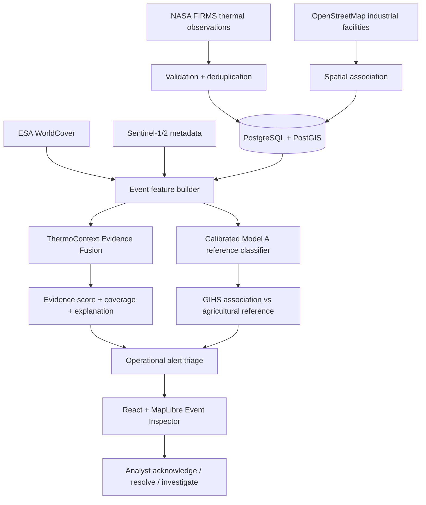

# INFERA: PS-162 Novelty and System Blueprint

## 1. Problem framing

SIH26162, issued by the National Technical Research Organisation (NTRO), requires an intelligent system for detecting and classifying industrial fires and persistent thermal sources using NASA FIRMS, OSM, and satellite data. The expected solution explicitly requires: (1) segregation of industrial fires from forest and other natural fires, and (2) GIS storage and map-overlay visualization.

A map of FIRMS points alone is not enough: the same thermal observation can represent industrial process heat, a short-lived industrial fire, crop-residue burning, a forest wildfire, or another non-industrial source.

INFERA therefore treats every event as a geospatial evidence problem. It combines the thermal observation with recurrence, mapped industrial context, land cover, sensor confidence, and the availability of corroborating satellite metadata. The platform gives an investigator a reasoned next action instead of presenting an unqualified binary label.

## 1.1 Compliance snapshot

| NTRO requirement | Repository status | Evidence |
|---|---|---|
| Industrial vs forest/natural-fire segregation | **Partially implemented, explicitly scoped** | TCEF provides `POSSIBLE_WILDFIRE_OR_NATURAL_BURNING` triage for natural-vegetation context; the checked-in Model A artifact is not a three-way wildfire classifier. |
| Persistent thermal-source identification | **Implemented** | FIRMS recurrence/persistence features, GIHS reference matching, Model A, TCEF, and alerts. |
| GIS storage and overlay visualization | **Implemented** | PostgreSQL/PostGIS, GeoJSON endpoints, MapLibre FIRMS/facility layers, event inspector, alert overlay. |
| Multi-source integration | **Implemented** | NASA FIRMS, OSM/Overpass, ESA WorldCover, Sentinel metadata, GIHS, crop-burning, and Asia wildfire references. |

The repository now includes `scripts/train_model_b_multiclass.py` as a fail-closed path for a calibrated three-way classifier. It will only train after the dataset builder produces valid event-level examples for all three classes: industrial heat, agricultural burning, and wildfire/natural burning. The current snapshot does not contain qualifying wildfire-matched FIRMS events, so no unsupported Model B artifact is shipped.

## 2. Project innovation

### ThermoContext Evidence Fusion (TCEF-v1)

TCEF is the PS-162-specific evidence layer now implemented in the backend and event inspector. It is a deterministic, auditable fusion of six signals:

| Signal | What it contributes | Weight |
|---|---|---:|
| Thermal signal | Log-scaled FRP and brightness temperature | 30% |
| Temporal persistence | Active days, recurrence count, and persistence duration | 25% |
| Industrial context | Distance to and count of nearby OSM industrial facilities | 25% |
| Land-cover context | ESA WorldCover built-up/cropland/other context | 10% |
| Sensor confidence | FIRMS confidence field | 7% |
| Corroboration coverage | Linked Sentinel metadata availability | 3% |

The output is deliberately called an **operational evidence score**, not a probability of fire. Missing signals reduce the data-coverage value, and every signal exposes its availability, contribution, weight, and explanation.

This provides a defensible project differentiator:

1. It fuses heterogeneous spatial and temporal evidence at event level.
2. It distinguishes persistent industrial heat from acute thermal intensity in the interpretation layer.
3. It makes uncertainty visible through data coverage and missing-signal reporting, including a separate natural-vegetation interpretation.
4. It keeps the restricted Model A reference classifier separate, avoiding the invalid claim that GIHS association equals confirmed industrial fire.
5. It produces an analyst-facing recommendation and evidence trail suitable for alert triage.

This is a project architecture contribution, not a claim of a new scientific classifier. The weights are transparent and should be recalibrated against reviewed field outcomes before safety-critical deployment.

## 3. Seven operational intelligence lenses

| Lens | Operational question | Current implementation |
|---:|---|---|
| 1. Live thermal surveillance | Where are the newest FIRMS anomalies? | NASA FIRMS ingestion and MapLibre layer |
| 2. Industrial context | Is a hotspot spatially associated with mapped infrastructure? | OSM/Overpass ingestion and PostGIS association |
| 3. Persistence | Is heat recurring at the same location? | 30-day spatial-temporal feature engineering |
| 4. Land-cover context | Does the surrounding land use support or contradict an industrial origin? | ESA WorldCover event-level enrichment |
| 5. TCEF evidence fusion | Do multiple independent signals justify escalation? | `POST /api/v1/evidence/assess/{event_id}` and Event Inspector panel |
| 6. Corroboration and limitations | Is linked satellite context available, and what is missing? | Sentinel metadata and TCEF data coverage |
| 7. Human response loop | Can an operator acknowledge, resolve, and review alerts? | Stateful alerts, evidence JSON, and dashboard actions |

## 4. End-to-end architecture

## 5. API contract

`POST /api/v1/evidence/assess/{event_id}`:

- regenerates the event’s factual feature record;
- returns `evidence_score` on a 0–100 scale;
- returns `observed_signal_strength` after normalizing only over available signals;
- returns `data_coverage` for configured signal weight;
- returns `priority`, `interpretation`, and `recommendation`;
- returns each signal’s score, weight, availability, and explanation;
- returns a caution that the result is not a calibrated fire probability.

`POST /api/v1/classification/predict-source/{event_id}` is the reserved Model B inference contract. It returns HTTP 503 until the three-way calibrated artifact exists; this fail-closed behavior prevents the current binary model from being mislabeled as an industrial-versus-wildfire classifier.

## 6. Interpretation policy

The system uses conservative language:

- `PERSISTENT_INDUSTRIAL_HEAT_CONTEXT` means recurring heat plus industrial spatial context, not a confirmed fire.
- `INDUSTRIAL_THERMAL_SOURCE_REVIEW` means strong thermal and industrial-context evidence merits review.
- `POSSIBLE_NON_INDUSTRIAL_BURNING` is a counter-signal informed by cropland and weak industrial context.
- `INSUFFICIENT_EVIDENCE` is returned when the available data does not support a reliable triage decision.

## 7. Validation plan

The current unit tests verify deterministic high-context, agricultural-context, and missing-data cases. A production validation study should add:

1. analyst-reviewed event labels across multiple Indian industrial regions;
2. temporal and geographic holdout splits;
3. calibration and alert-volume analysis;
4. comparison with the restricted Model A reference classifier;
5. false-alarm review for crop burning, flares, construction, and sensor artifacts.

Until that study is completed, TCEF is an explainable triage aid and not an autonomous emergency-dispatch system.

## 8. Dataset and classifier boundary

The local Asia wildfire reference table contains 996 records, but it is tabular burn metadata and is not currently paired with matching FIRMS event-level feature vectors in the checked-in training dataset. The current candidate dataset has 368 high-confidence labeled rows: 277 GIHS industrial references and 91 Punjab agricultural references, with no wildfire class. This is why a three-way score cannot be honestly reported yet.

The updated dataset builders retain `source_class` as a separate label provenance field while keeping the existing binary `target_label` for Model A compatibility. `source_class` is excluded from feature matrices to prevent label leakage.

## 9. Relationship to Model A

Model A remains useful within its documented scope: it distinguishes GIHS-associated industrial heat-source reference events from agricultural-burning reference events. TCEF does not silently convert that restricted model output into a general industrial-fire probability. The two outputs are shown as complementary evidence products so operators can see both the trained reference model and the broader transparent context score. Model B is reserved for the three-way industrial/agricultural/wildfire reference classifier after the required labels are available.
